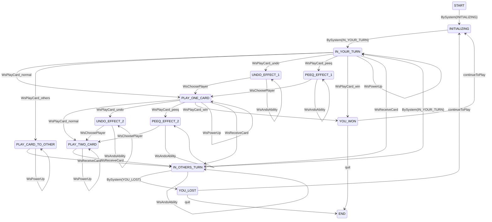

```mermaid
stateDiagram
    START --> INITIALIZING : BySystem(INITIALIZING)
    INITIALIZING --> IN_YOUR_TURN : BySystem(IN_YOUR_TURN)

    IN_YOUR_TURN --> PLAY_ONE_CARD : WsPlayCard_normal
    IN_YOUR_TURN --> PLAY_CARD_TO_OTHER : WsPlayCard_others
    IN_YOUR_TURN --> UNDO_EFFECT_1 : WsPlayCard_undo
    IN_YOUR_TURN --> PEEQ_EFFECT_1 : WsPlayCard_peeq
    IN_YOUR_TURN --> YOU_WON : WsPlayCard_win
    IN_YOUR_TURN --> IN_YOUR_TURN : WsAndoAbility
    IN_YOUR_TURN --> IN_YOUR_TURN : WsPowerUp
    IN_YOUR_TURN --> IN_OTHERS_TURN : WsReceiveCard

    PLAY_ONE_CARD --> PLAY_TWO_CARD : WsPlayCard_normal
    PLAY_ONE_CARD --> UNDO_EFFECT_2 : WsPlayCard_undo
    PLAY_ONE_CARD --> PEEQ_EFFECT_2 : WsPlayCard_peeq
    PLAY_ONE_CARD --> YOU_WON : WsPlayCard_win
    PLAY_ONE_CARD --> PLAY_ONE_CARD : WsAndoAbility
    PLAY_ONE_CARD --> IN_OTHERS_TURN : WsReceiveCard
    PLAY_ONE_CARD --> PLAY_ONE_CARD : WsPowerUp
    
    IN_OTHERS_TURN --> IN_YOUR_TURN : BySystem(IN_YOUR_TURN)
    IN_OTHERS_TURN --> YOU_LOST : BySystem(YOU_LOST)
    IN_OTHERS_TURN --> IN_OTHERS_TURN : WsAndoAbility

    UNDO_EFFECT_1 --> PLAY_ONE_CARD : WsChoosePlayer
    UNDO_EFFECT_1 --> UNDO_EFFECT_1 : WsAndoAbility
    UNDO_EFFECT_2 --> PLAY_TWO_CARD : WsChoosePlayer
    UNDO_EFFECT_2 --> UNDO_EFFECT_2 : WsAndoAbility

    PEEQ_EFFECT_1 --> PLAY_ONE_CARD : WsChoosePlayer
    PEEQ_EFFECT_1 --> PEEQ_EFFECT_1 : WsAndoAbility
    PEEQ_EFFECT_2 --> PLAY_TWO_CARD : WsChoosePlayer
    PEEQ_EFFECT_2 --> PEEQ_EFFECT_2 : WsAndoAbility

    PLAY_TWO_CARD --> IN_OTHERS_TURN : WsReceiveCard
    PLAY_TWO_CARD --> PLAY_TWO_CARD : WsAndoAbility
    PLAY_TWO_CARD --> PLAY_TWO_CARD : WsPowerUp

    PLAY_CARD_TO_OTHER --> IN_OTHERS_TURN : WsReceiveCard
    PLAY_CARD_TO_OTHER --> PLAY_CARD_TO_OTHER : WsAndoAbility
    PLAY_CARD_TO_OTHER --> PLAY_CARD_TO_OTHER : WsPowerUp

    YOU_WON --> INITIALIZING : continueToPlay
    YOU_WON --> END : quit

    YOU_LOST --> INITIALIZING : continueToPlay
    YOU_LOST --> END : quit
```
